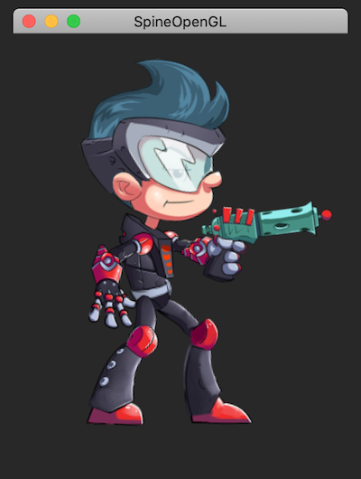
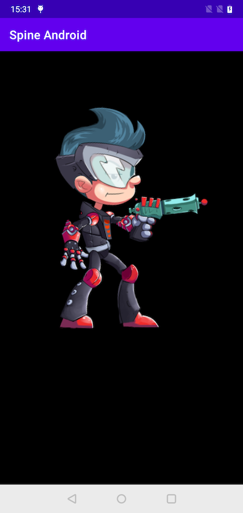
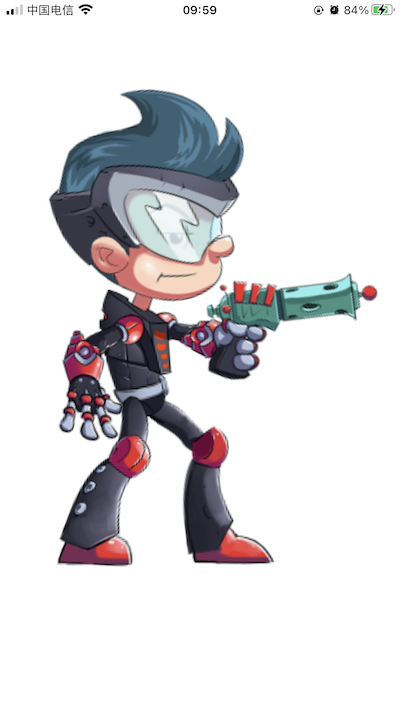

# Render Spine Animation Using OpenGL/OpenGL ES
## Background

Spine is 2D skeletal animation software for video games with many kinds of runtime implement, see [https://github.com/EsotericSoftware/spine-runtimes](https://github.com/EsotericSoftware/spine-runtimes), here we render it with OpenGL/OpenGL ES on Mac/Android/iOS.

The image resouces is loaded by stb_image, see [https://github.com/nothings/stb](https://github.com/nothings/stb) 


## Build
### Mac
The opengl context is created by GLFW (already included in the project).

```
cd Mac
mkdir build
cd build
cmake ..
make
```



### Android
The opengl context is created by TextureView, no other dependency needed.

```
cd Android
// open with your AndroidStudio
```



### iOS
The opengl context is created by GLKView and render loop is drived by CADisplayLink.

```
cd iOS
// open with your XCode
```



## License
This code is licensed under the MIT License (see [LICENSE](LICENSE)).
